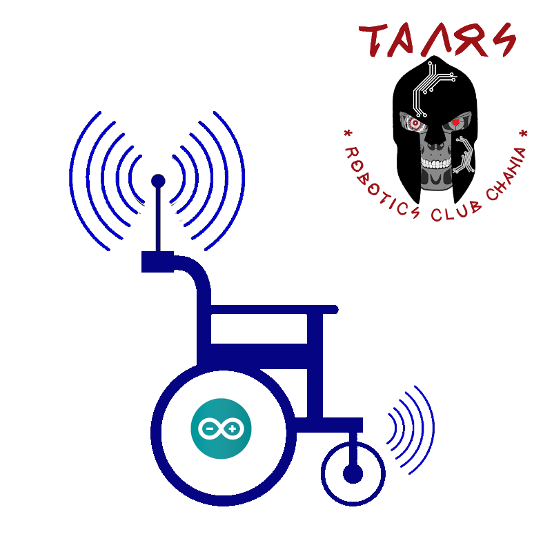
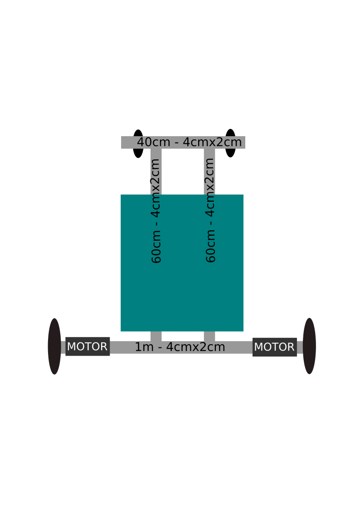
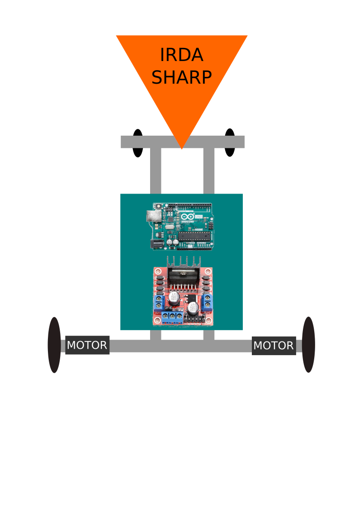
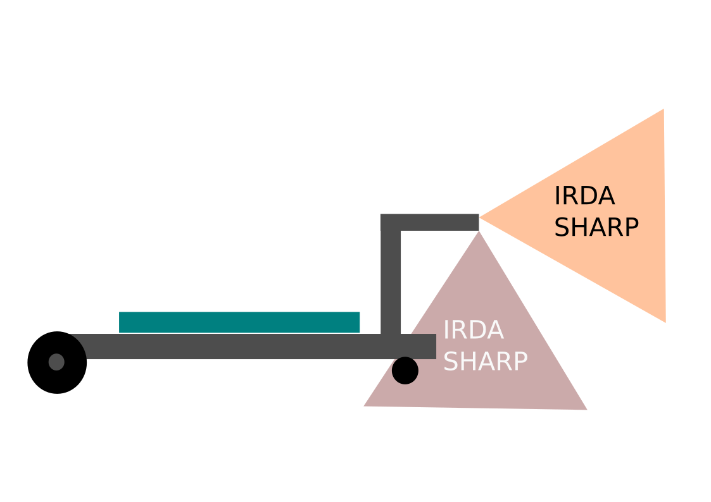
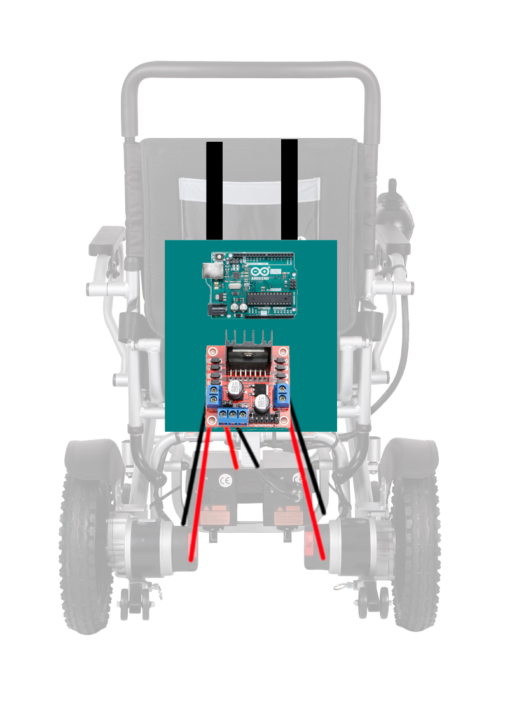
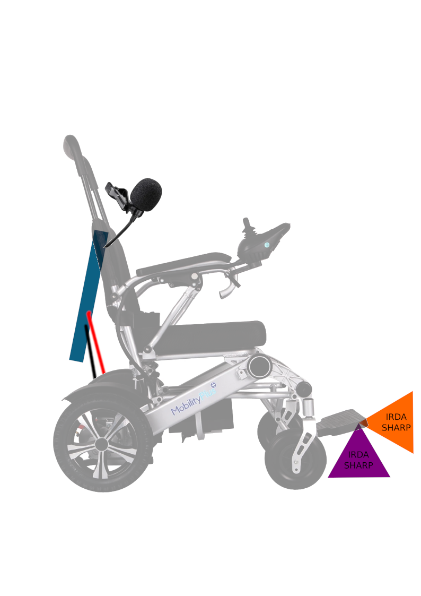
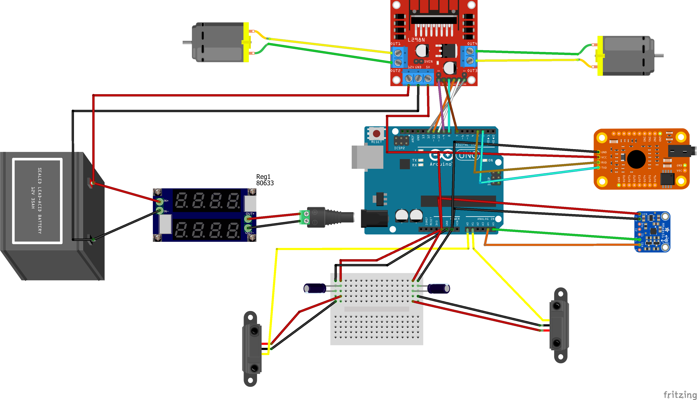
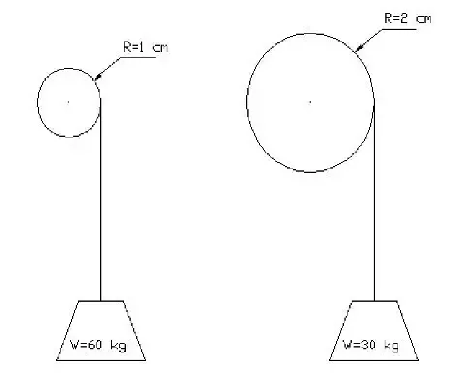

#   

# (The Robowheels project)

# Αυτοματοποιημένο αναπηρικό αμαξίδιο

## <u>Συμμετέχοντες</u>

### Υπεύθυνος εκπαιδευτικός

Μανούσακας Μανούσος - Εκπαιδευτικός Πληροφορικής ΠΕ86

### Μαθητές

*   Αναστασάκης Ιωάννης
*   Ρουσιάκης Πέτρος
*   Στραβοπόδη Κωνσταντίνα

# <u>Γενικά στοιχεία σεναρίου</u>

## Σενάριο δραστηριότητας

Αριθμός μαθητών: 5  
Αριθμός Ομάδων: 2  
Αριθμός ατόμων ανά ομάδα: 2-3  
Είδος δραστηριότητας: Ομαδοσυνεργατική  
Ρόλοι: Δεν υπάρχουν διακριτοί ρόλοι στην ομάδα.  
Ηλικιακή ομάδα: 12-15  

## Φάση προετοιμασίας

Οι μαθητές θα πρέπει να:  
• Διερευνήσουν στο διαδίκτυο και να ανακαλύψουν τις ανάγκες των ατόμων με κινητικά προβλήματα.  
• Συντάξουν ένα έντυπο όπου θα περιγράφουν τις προδιαγραφές του project.  
• Να αναζητήσουν στο διαδίκτυο πληροφορίες για τους αισθητήρες που θα χρησιμοποιήσουμε.  

## Φάση σχεδιασμού

Οι μαθητές θα πρέπει να:  
• Να αναζητήσουν στο διαδίκτυο πληροφορίες για τη συνδεσμολογία των αισθητήρων με το Arduino.  
• Να αναζητήσουν στο διαδίκτυο πληροφορίες για τις προδιαγραφές των αισθητήρων.  
• Να δημιουργήσουν στο Fritzing τις παραπάνω συνδεσμολογίες.  

## Φάση υλοποίησης

Οι μαθητές θα πρέπει να:  
• Δημιουργήσουν τις φυσικές συνδέσεις των υλικών τους με τους αισθητήρες.  
• Να προγραμματίσουν το Arduino χρησιμοποιώντας το περιβάλλον Arduino IDE έτσι ώστε να παίρνουν τιμές από τους αισθητήρες.  

## Φάση Δοκιμών

Οι μαθητές θα πρέπει να:  
• Δοκιμάσουν τον εξοπλισμό τους και να επιβεβαιώσουν τη σωστή λειτουργία του.  

# Υλικά ηλεκτρονικά

<table style="width: 100%;" border="1">

<tbody>

<tr>

<th>ΠΟΣΟΤΗΤΑ</th>

<th>ΕΙΔΟΣ</th>

<th>ΚΟΣΤΟΣ</th>

<th>Σχόλια</th>

</tr>

<tr>

<td>1</td>

<td>ARDUINO UNO</td>

<td>25</td>

<td></td>

</tr>

<tr>

<td>2</td>

<td>GP2Y0A21YK0F Sharp IR Analog Distance Sensor</td>

<td>20</td>

<th>  
</th>

</tr>

<tr>

<td>1</td>

<td>Adafruit Επιταχυνσιόμετρο 3 Αξόνων ±2/4/8g @ 14-bit - MMA8451</td>

<td>8</td>

<th>  
</th>

</tr>

<tr>

<td>2</td>

<td>12V 35RPM JGY37-520 - 37mm Eccentric Large Torque Gear Motor Gearbox with Metal Gearbox</td>

<td>13</td>

<th>  
</th>

</tr>

<tr>

<td>1</td>

<td>Οδηγός για Βηματικό Κινητήρα L298N Dual H Bridge</td>

<td>4</td>

<th>  
</th>

</tr>

<tr>

<td>3</td>

<td>LM2596 Step Down Module DC 3V-40V to 5V 12V 3A Voltage Regulator</td>

<td>15</td>

<th>  
</th>

</tr>

<tr>

<td>1</td>

<td>Voice Recognition Module Rev3 Kit -Arduino Compatible</td>

<td>32</td>

<th>  
</th>

</tr>

<tr>

<td>1</td>

<td>SIM808 GPS GSM GPRS Bluetooth Module W/2.4G Antenna Replace SIM908 For Arduino</td>

<td>44</td>

<th>  
</th>

</tr>

<tr>

<td>2</td>

<td>Πυκνωτές >10μF</td>

<td>1</td>

<td></td>

</tr>

<tr>

<td>2</td>

<td>UPS BATTERY 12V 14AH MAX. 210A</td>

<td>20</td>

<td></td>

</tr>

<tr>

<td>  
</td>

<td>Σύνολο</td>

<td>170</td>

<th>  
</th>

</tr>

</tbody>

</table>

## Χρήσιμα αρχεία

<table style="width: 100%;" border="1">

<tbody>

<tr>

<th>ΠΕΡΙΓΡΑΦΗ</th>

<th>ΜΕΤΑΦΟΡΤΩΣΗ</th>

<th>ΣΧΟΛΙΑ</th>

</tr>

<tr>

<td>SharpIR Βιβλιοθήκη</td>

<td><a href="https://github.com/guillaume-rico/SharpIR.git">SharpIR Βιβλιοθήκη</a></td>

<td></td>

</tr>

<tr>

<td>Adafruit MMA8451 Βιβλιοθήκη</td>

<td><a href="https://github.com/adafruit/Adafruit_MMA8451_Library.git">Adafruit MMA8451 Βιβλιοθήκη</a></td>

<th>  
</th>

</tr>

<tr>

<td>Adafruit Sensor Βιβλιοθήκη</td>

<td><a href="https://github.com/adafruit/Adafruit_Sensor.git">Adafruit Sensor Βιβλιοθήκη</a></td>

<td></td>

</tr>

<tr>

<td>Voice Recognition Module οδηγός χρήσης</td>

<td><a href="images/VR3_manual.pdf">VR3_manual.pdf</a></td>

<td></td>

</tr>

<tr>

<td>Voice Recognition Module Βιβλιοθήκη</td>

<td><a href="https://www.google.com/url?q=https%3A%2F%2Fgithub.com%2Felechouse%2FVoiceRecognitionV3%2Farchive%2Fmaster.zip&sa=D&sntz=1&usg=AFQjCNE7a6-RkPLi9FMpjxIFqR-6OoMh5Q">VR3 library</a></td>

<td></td>

</tr>

<tr>

<td>L298N Βιβλιοθήκη</td>

<td><a href="https://downloads.arduino.cc/libraries/github.com/AndreaLombardo/L298N-2.0.2.zip?_gl=1*4jdbxj*_ga*MTg5MDYwNzAzMC4xNjMyNDIyNjU0*_ga_NEXN8H46L5*MTYzMjk5NjE0Mi42LjAuMTYzMjk5NjE0Mi4w">L298N</a></td>

<td></td>

</tr>

<tr>

<td></td>

<td></td>

<td></td>

</tr>

</tbody>

</table>

## Υλικά για την κατασκευή

<table style="width: 100%;" border="1">
<tbody>
<tr>
<th>ΠΟΣΟΤΗΤΑ</th>
<th>ΕΙΔΟΣ</th>
<th></th>
<th>Σχόλια</th>
</tr>
<tr>
<td style="text-align: center;">1</td>
<td>Ράβδος αλουμινίου 4cm x 2cm  Μήκος - 1m</td>
<td></td>
<td></td>
</tr>
<tr>
<td style="text-align: center;">2</td>
<td>Ράβδος αλουμινίου 4cm x 2cm  Μήκος - 40 cm</td>
<td></td>
<td></td>
</tr>
<tr>
<td style="text-align: center;">2</td>
<td>Βάση για μοτέρ 3d μοντέλο για εκτύπωση</td>
<td></td>
<td><a href="https://github.com/talos-robotics/Robowheels/blob/main/images/JGB37-520%20mount.STL">Κατεβάστε απο εδώ</a></td>
</tr>
<tr>
<td></td>
<td>Βίδες αυτοδιάτρητες  - διάφορα μεγέθη</td>
<td></td>
<td></td>
</tr>
<tr>
<td style="text-align: center;">2</td>
<td>Ασφάλειες μεταλλικές - κοπίλια</td>
<td></td>
<td></td>
</tr>
<tr>
<td style="text-align: center;">2</td>
<td>Ρόδες  με διάμετρο υποδοχής 6mm</td>
<td></td>
<td></td>
</tr>
<tr>
<td style="text-align: center;">1</td>
<td>Γωνιακό προφίλ αλουμινίου 40 cm</td>
<td></td>
<td></td>
</tr>
<tr>
<td style="text-align: center;">1</td>
<td>Μονοτική ταινία</td>
<td></td>
<td></td>
</tr>
<tr>
<td style="text-align: center;">2</td>
<td>Ράβδος αλουμινίου 4cm x 2cm  Μήκος - 20m</td>
<td></td>
<td></td>
</tr>
<tr>
<td style="text-align: center;">12</td>
<td>Βίδες Υ:2cm Π:4χιλ.</td>
<td></td>
<td></td>
</tr>
<tr>
<td style="text-align: center;"></td>
<td>Καλώδια 0.4 mm Διάφορα χρώμματα</td>
<td></td>
<td></td>
</tr>
<tr>
<td style="text-align: center;"></td>
<td>Κολλητήρι -  Καλάι</td>
<td></td>
<td></td>
</tr>
<tr>
<td style="text-align: center;"></td>
<td>Πιστόλι σιλικόνης - Ράβδοι συλικόνης</td>
<td></td>
<td></td>
</tr>
<tr>
<td style="text-align: center;"></td>
<td>Δραπανοκατσάβιδο μπαταρίας</td>
<td></td>
<td></td>
</tr>
<tr>
<td style="text-align: center;">2</td>
<td>Ροδάκια Επίπλων Περιστρεφόμενα</td>
<td></td>
<td></td>
</tr>
</tbody>
</table>

## Κατασκευή υποτιθέμενου αμαξιδίου ( εξομοιωτή )

## Προοπτική κατασκευής σε πραγματικό αμαξίδιο

	
### <big>Αναλυτική περιγραφή</big>

Οι μαθητές αφού βρουν στοιχεία για την τετραπληγία και την παραπληγία 
θα μελετήσουν τις ανάγκες και τις λειτουργικές ικανότητες των ατόμων αυτών. 
Σκοπός είναι η δημιουργία ενός αυτοματοποιημένου οχήματος μετακίνησης που θα
προσαρμόζεται ανάλογα το μέλος του σώματος που θα είναι ικανός να θέσει σε
κίνηση ο χρήστης του. Θα παρέχει βασικές δικλείδες ασφαλείας για την ακινητοποίησή του.

<b>Ένα ηλεκτρικό αναπηρικό αμαξίδιο κοστίζει από 3000 ευρώ και πάνω. Θα ήταν αδύνατο να έχουμε στη διάθεση μας κάτι τέτοιο έτσι ώστε να το τροποποιήσουμε και να πειραματιστούμε.Άλλωστε ας μην ξεχνάμε πως ο διαγωνισμός έχει εκπαιδευτικό χαρακτήρα. Έτσι λοιπόν θα δημιουργήσουμε μια απλή κατασκευή που θα προσομοιώνει το αμαξίδιο και θα πειραματιστούμε πάνω σε αυτό. Οι αρχές λειτουργίας παραμένουν οι ίδιες.</b>
	
Ανάλογα την οικονομική και χρονική δυνατότητα που θα έχουμε, θα μπορούσε να προστεθεί 
και σύστημα εντοπισμού θέσης και επικοινωνίας που θα μπορεί να θέσει 
ο χρήστης σε λειτουργία σε περίπτωση κινδύνου.

Σκοπός και οφέλη

    • Ευαισθητοποίηση των μαθητών στο κοινωνικό θέμα της αναπηρίας.
    • Αναζήτηση λύσεων μετά από μελέτη προδιαγραφών και απαιτήσεων.
    • Εισαγωγή στην κατασκευή και λειτουργία βασικών ηλεκτρονικών κυκλωμάτων.
    • Εισαγωγή σε προγραμματιστικά περιβάλλοντα.
    • Εισαγωγή σε θέματα μηχανικής και κατασκευών.
    • Ομαδική δουλειά και συνεργασία.

# <u>Πλατφόρμες που χρησιμοποιήθηκαν</u>

Όλα τα διαδικτυακά εργαλεία που χρησιμοποιήσαμε ανήκουν στο Πανελλήνιο σχολικό δίκτυο.  

<small><small><small><small>**Πλατφόρμες εργασίας**</small></small></small></small>

<dl>

<dt><small><small><small><small>**Ηλεκτρονική τάξη:** https://eclass.sch.gr</small></small></small></small></dt>

<dt><small><small><small><small>**Πλατφόρμα τηλεδιασκέψεων:** cisco webex</small></small></small></small></dt>

<dt><small><small><small><small>**Ομαδοσυνεργατικά έγγραφα:** https://grafis.sch.gr</small></small></small></small></dt>

<dt><small><small><small><small>**Ηλεκτρονικό ταχυδρομείο:** https://webmail.sch.gr</small></small></small></small></dt>

<dt><small><small><small><small>**Υπηρεσία Επικοινωνίας:**</small></small><small> <small></small> </small><small><small>https://www.uc.sch.gr</small></small></small></small></dt>

</dl>

# <u>Εργαλεία ΕΛΛΑΚ που χρησιμοποιήθηκαν</u>

*   Libreoffice
*   Linux - Elementary OS
*   Arduino IDE
*   Fritzing

# <u>Πληροφορίες για το υλικό</u>

### Αισθητήρας GP2Y0A21 IRDA

 

Οι αισθητήρες απόστασης Sharp είναι μια δημοφιλής επιλογή για πολλά έργα που απαιτούν ακριβείς μετρήσεις απόστασης. 

Αυτός ο αισθητήρας υπερύθρων είναι απο τους πιο οικονομικούς, ωστόσο παρέχει πολύ καλύτερη απόδοση από άλλες εναλλακτικές λύσεις IR.
Η διασύνδεση με τους περισσότερους μικροελεγκτές είναι απλή.
Το εύρος ανίχνευσης αυτής της έκδοσης είναι περίπου 10 cm έως 80 cm (4 ″ έως 32).

Το GP2Y0A21 χρησιμοποιεί υποδοχή 3 ακίδων.Αυτά τα καλώδια έχουν συνδετήρες JST 3 ακίδων στο ένα άκρο και διατίθενται με προ-πτυχωμένες αρσενικές ακίδες,
στο άλλο άκρο. 
Είναι επίσης δυνατή η συγκόλληση τριών καλωδίων στον αισθητήρα όπου είναι τοποθετημένες οι ακίδες σύνδεσης 

	Κόκκινο --> 5V
	Μαύρο --> GND
	Κίτρινο --> DATA (Αναλογικό)

### Αισθητήρας Adafruit Επιταχυνσιόμετρο 3 Αξόνων ±2/4/8g @ 14-bit - MMA8451

 

Το MMA8451 είναι ένα μικροσκοπικό επιταχυνσιόμετρο από την Freescale, η οποία είναι (πλέον) αυθεντία στο παιχνίδι του σχεδιασμού επιταχυνσιόμετρων.
Έχει σχεδιαστεί για χρήση σε τηλέφωνα, tablet, έξυπνα ρολόγια και άλλα, αλλά λειτουργεί εξίσου καλά και στο έργο σας Arduino.
Από την οικογένεια MMA8451/MMA8452/MMA8453, ο MMA8451 είναι ο πιο ακριβής με ενσωματωμένο ADC 14-bit.
Το επιταχυνσιόμετρο διαθέτει επίσης ενσωματωμένη ανίχνευση κλίσης/προσανατολισμού, ώστε να μπορεί να σας πει αν το έργο σας βρίσκεται σε οριζόντια ή κατακόρυφη θέση
και αν έχει κλίση προς τα εμπρός ή προς τα πίσω.

Τυπική Τάση Εισόδου:
    3VDC
    5VDC
Ρεύμα Λειτουργίας: 165uA
Διασύνδεση:Ψηφιακή 
Πρωτόκολλο Eπικοινωνίας:I2C

 **Αρχή λειτουργίας επιταχυνσιόμετρου.**

	

### Κινητήρας dc 12V 35RPM JGY37-520 - 37mm Eccentric Large Torque Gear Motor Gearbox with Metal Gearbox

Οι Κινητήρες DC είναι συνεχείς ενεργοποιητές που μετατρέπουν την ηλεκτρική ενέργεια σε μηχανική ενέργεια. Ο κινητήρας DC επιτυγχάνει αυτό με τη δημιουργία μιας συνεχούς γωνιακής περιστροφής που μπορεί να χρησιμοποιηθεί για την περιστροφή αντλιών, ανεμιστήρων, συμπιεστών, τροχών κλπ. Ο κινητήρας DC ή κινητήρας συνεχούς ρεύματος για να του δώσουμε τον πλήρη τίτλο του είναι ο συνηθέστερα χρησιμοποιούμενος κινητήρας για την παραγωγή συνεχούς κίνηση και της οποίας η ταχύτητα περιστροφής μπορεί εύκολα να ελεγχθεί, καθιστώντας τους ιδανικά για χρήση σε διάφορες εφαρμογές. Ένας ηλεκτροκινητήρας συνεχούς ρεύματος αποτελείται από δύο μέρη, έναν "στάτορα" που είναι το σταθερό τμήμα και έναν "περιστροφέα" που είναι το περιστρεφόμενο τμήμα. Οι κινητήρες DC έχουν σχεδόν γραμμικά χαρακτηριστικά με την ταχύτητα περιστροφής τους να καθορίζεται από την εφαρμοζόμενη τάση συνεχούς ρεύματος και η ροπή εξόδου τους να καθορίζεται από το ρεύμα που ρέει μέσω των περιελίξεων του κινητήρα. Η ταχύτητα περιστροφής κάθε κινητήρα DC μπορεί να ποικίλει από μερικές περιστροφές ανά λεπτό (σ.α.λ.) σε πολλές χιλιάδες στροφές ανά λεπτό, καθιστώντας τις κατάλληλες για ηλεκτρονικές, αυτοκινητοβιομηχανικές ή ρομποτικές εφαρμογές. Συνδυάζοντας τους με κιβώτια ταχυτήτων (Gearbox), η ταχύτητα εξόδου τους μπορεί να μειωθεί, ενώ παράλληλα αυξάνει την ισχύ ροπής του κινητήρα σε υψηλή ταχύτητα.

### Οδηγός για Βηματικό Κινητήρα L298N Dual H Bridge

Το L298N είναι ένας οδηγός για κινητήρες συνεχούς ρεύματος. Με αυτό το πλακετάκι μπορείς να δώσεις κίνηση στους κινητήρες σου, υποστηρίζει έως δύο κινητήρες μέγιστης ισχύς 2A ανά κινητήρα. Μικρός σε μέγεθος για εφαρμογή σε πλήθος κατασκευών, διαθέτει κλέμες για την σύνδεση των κινητήρων και του ρεύματος. Έχεις την δυνατότητα να το χρησιμοποιήσεις και σε μεγαλύτερο εύρος εφαρμογών εκτός από κινητήρες, όπως ρελέ, solenoids, DC ή Stepper κινητήρες.

ΧΑΡΑΚΤΗΡΙΣΤΙΚΑ
Max. Current per Channel: 2A
Τύπος Οδηγού: DC Motor Stepper

ΕΠΙΠΛΕΟΝ ΧΑΡΑΚΤΗΡΙΣΤΙΚΑ

Driver: L298N Dual H Bridge DC Motor Driver IC
Motor Power Supply Vs: +5 V to +35 V
Max average current: 2A
Peak current Io: 3A
Logic Level Power Vss: +5 V ~ +7 V (Onboard 5V Regulator can be used if Motor Power is > 7.0V)
Logic level power: 0 - 36mA
Logic signal input range: [ Low:-0.3V ≤ Vin ≤ 1.5V] [ High: 2.3V ≤ Vin ≤ Vss]
Maximum power dissipation: 20W (when the temperature T = 75 ℃)

### Μετατροπέας DC-DC Step-Down 1.3-35V 3A

Πρόκειται για ένα DC Adjustable Step Down Module που μπορεί να χρησιμοποιηθεί 
για την επίτευξη εύρους ρυθμιζόμενης τάσης εξόδου 1.3V-35V με βάση το LM2596S.
Περιλαμβάνει LC Ripple Filtering για ομαλότερη τάση εξόδου.

ΧΑΡΑΚΤΗΡΙΣΤΙΚΑ
Τάση Εισόδου: 3.2-40Volt
Τάση Εξόδου: 1.3-35Volt
Ένταση Εξόδου: 3Amp
ΕΠΙΠΛΕΟΝ ΧΑΡΑΚΤΗΡΙΣΤΙΚΑ

    Input voltage 3.2V - 40V
    Output voltage 1.3V - 35V
    Output current 3A (max)
    Conversion efficiency of 92% (maximum)
    Output ripple <30mV
    Switching frequency 65KHz
    Operating temperature -45 ℃ ~ +85 ℃

### Αισθητήρας Αναγνώρισης Φωνής

Το Voice Recognition Module είναι μια εύχρηστη μονάδα αναγνώρισης ομιλίας που μπορεί εύκολα να διασυνδεθεί με το Arduino.
Υποστηρίζει συνολικά έως και 80 φωνητικές εντολές.
Μέγιστες 7 φωνητικές εντολές θα μπορούσαν να λειτουργήσουν ταυτόχρονα. Κάθε ήχος θα μπορούσε να εκπαιδευτεί ως εντολή.
Οι χρήστες πρέπει πρώτα να εκπαιδεύσουν τη μονάδα πριν την αφήσουν να αναγνωρίσει οποιαδήποτε φωνητική εντολή.

ΧΑΡΑΚΤΗΡΙΣΤΙΚΑ
Τύπος Αισθητήρα:

    Ήχου

Τυπική Τάση Εισόδου:

    5VDC
    5.5VDC

Ρεύμα Λειτουργίας: 40mA
Διασύνδεση:

    Ψηφιακή 

Πρωτόκολλο Eπικοινωνίας:

    UART

ΕΠΙΠΛΕΟΝ ΧΑΡΑΚΤΗΡΙΣΤΙΚΑ

    Voltage: 4.5-5.5V
    Current: <40mA
    Digital Interface: 5V TTL level for UART interface and GPIO
    Analog Interface: 3.5mm mono-channel microphone connector + microphone pin interface
    Recognition accuracy: 99% (under ideal environment)

### Waveshare GSM/GPRS/GPS Shield SIM808 - Χρειάζεται μόνο για την περίπτωση αναβάθμισης - επέκτασης. Όχι για αυτή την βασική έκδοση. Θα δημιουργηθεί σαν ξεχωριστό project στο μέλλον

Το GSM/GPRS/GPS Shield (B) είναι μια ασπίδα Arduino που βασίζεται στη μονάδα τεσσάρων ζωνών GSM/GPRS/GPS SIM808.

ΧΑΡΑΚΤΗΡΙΣΤΙΚΑ
Τυπος Shield:

    GPRS/GSM
    GPS

ΕΠΙΠΛΕΟΝ ΧΑΡΑΚΤΗΡΙΣΤΙΚΑ

    Arduino connectivity, compatible with UNO, Leonardo, NUCLEO, XNUCLEO
    Onboard USB TO UART converter CP2102 for UART debugging
    5 x LEDs for indicating the module working status
    Onboard voltage level converter, supports both 3.3V and 5V systems
    SIM card slot for 1.8V/3V SIM card
    Baudrate auto detection (1200bps ~115200bps)
    Bluetooth 3.0， supports data transferring through Bluetooth
    RTC with power supply interface
    Firmware upgradable via USB
    Control via AT commands (3GPP TS 27.007,27.005, and SIMCOM enhanced AT Commands)
    Supports SIM application toolkit: GSM 11.14 Release 99
    Operating voltage: 6 ~ 12V
    Operation temperature: -40 °C ~ +85 °C
    Storage temperature: -45 °C ~ +90 °C

ΔΥΝΑΤΟΤΗΤΕΣ

GSM/GPRS

    Band
        GSM 850/EGSM 900/DCS 1800/PCS 1900 MHz
        Quad-band auto search
        Compliant to GSM phase 2/2+
    Emitting power
        Class 4 (2W @ GSM 850/EGSM 900 MHz)
        Class 1 (1W @ DCS 1800/PCS 1900 MHz)
    GPRS connectivity
        GPRS multi-slot class 12 (default)
        GPRS multi-slot class 1~12 (configurable)
    GPRS data feature
        Downlink speed: max 85.6kbps
        Uplink speed: max 85.6kbps
        Coding schemes: CS-1\CS-2\CS-3\CS-4
        Supports PAP (Password Authentication Protocol) for PPP connection
        Embedded TCP/IP protocol
        Supports PBCCH
        Supports CSD transmission speed: 2.4/4.8/9.6/14.4 kbps
        Supports USSD
    SMS
        Supports: MT/MO/CB/Text/PDU mode
        SMS storage: SIM card
    Audio
        Voice encode/decode mode: Half Rate\Full Rate\Enhanced Full Rate\Adaptive muti rate
        Supports echo cancellation
        Supports noise reduction

GPS

    Receiver type
        22 tracking channels
        66 acquisition channels
        GPS L1 C/A code
    Sensitivity
        Tracking: -165 dBm
        Cold starts : -148 dBm
    Time-To-First-Fix
        Cold starts : 30s (typ.)
        Hot starts : < 1s
        Warm starts: 28s
    Accuracy
        Horizontal position : <2.5m CEP

# Συνδεσμολογία Υλικού

**<u>ΠΕΡΙΓΡΑΦΗ ΛΕΙΤΟΥΡΓΙΑΣ - Με τη χρήση ΜΜΑ8451</u>**

Στη συγκεκριμένη εκδοχή χρησιμοποιούμε ένα γυροσκοπικό αισθητήρα τον οποίο τον προσαρμόζουμε στο μέλος του σώματος που μπορεί το άτομο με τετραπληγία να κινήσει. Ανάλογα την κλήση που δέχεται ο γυροσκοπικός αισθητήρας από τον χρήστη εκτελεί τις αντίστοιχες κινήσεις.  Όταν τον γείρει μπροστά τα μοτέρ εκτελούν εμπρόσθια κίνηση. Όταν τον γείρει πίσω τα μοτέρ εκτελούν κίνηση προς τα πίσω.  Αντίστοιχα όταν τον γείρει δεξιά ή αριστερά τα μοτέρ εκτελούν τις αντίστοιχες κινήσεις.

#### Κατεβάστε τον κώδικα

<a href="/files/robowheelsDC.ino">Κώδικας με τον αισθητήρα MMA8451</a>

**<u>ΠΕΡΙΓΡΑΦΗ ΛΕΙΤΟΥΡΓΙΑΣ - Με τη χρήση Αναγνώρισης φωνής</u>**

Στη συγκεκριμένη εκδοχή χρησιμοποιούμε μία μονάδα αναγνώρισης φωνής και με φωνητικές εντολές, οι οποίες 
έχουν προγραμματιστεί εκ των προτέρων, μπορεί να θέσει σε κίνηση ο χρήστης τα μοτέρ.
Για παράδειγμα θα μπορούσε να πει τη λέξη μπροστά και τα μοτέρ να εκτελέσουν εμπρόσθια κίνηση.
Θα μπορούσε να πει τη λέξη δεξιά και τα μοτέρ να εκτελέσουν δεξιά στροφή.
Θα μπορούσε να πει την λέξη stop για να μπορέσει να τερματίσει τη λειτουργία του μοτέρ.
Ένα πλεονέκτημα της  συγκεκριμένης μονάδας αναγνώρισης φωνής,  είναι ότι είναι ανεξάρτητη γλώσσας  και χροιάς.
Μπορεί και συγκρίνει τους φόνους με αυτό που έχουμε καταγράψει αρχικά.
Ενα βασικό μειονέκτημα της πολύ σημαντικό είναι ότι επηρεάζεται αρνητικά από τους περιβάλλοντες ήχους με
αποτέλεσμα να μην μπορεί να γίνει σωστά η αναγνώριση.

<a href="/files/robowheels_voiceDC.ino">Κώδικας με τον αισθητήρα voice</a>
	

#### Συνδεσμολογία

  

#### Εκπαιδεύστε το module σας

# <u>
Στάδια εξέλιξης - Τελικό πρωτότυπο
</u>

## Βίντεο

	
## Φωτογραφίες
<table style="width: 100%;" border="1">
<tbody>
<tr align="center">
<td></td>
<td></td>
<td></td>
<td></td>
</tr>
<tr align="center">
<td></td>
<td></td>
<td></td>
<td></td>
</tr>
<tr align="center">
<td></td>
<td></td>
<td></td>
<td></td>
</tr>
<tr align="center">
<td></td>
<td></td>
<td></td>
<td></td>
</tr>
<tr align="center">
<td></td>
<td></td>
<td></td>
<td></td>
</tr>
<tr align="center">
<td></td>
<td></td>
<td></td>
<td></td>
</tr>
<tr align="center">
<td></td>
<td></td>
<td></td>
<td></td>
</tr>
<tr align="center">
<td></td>
<td></td>
<td></td>
<td></td>
</tr>
<tr align="center">
<td></td>
<td></td>
<td></td>
<td></td>
</tr>
</tbody>
</table>

# <u>
Τελικά συμπερασματα
</u>

### Γενικά

Το παρόν project ολοκληρώθηκε με επιτυχία. Οι μαθητές πέτυχαν τους γνωστικούς στόχους και ενεπλάκησαν ενεργά σε γνωστικούς πυλώνες όπως η Επιστήμη, η Τεχνολογία, η Μηχανική και τα Μαθηματικά – STEM. Προγραμματιστικά οι μαθητές απέδωσαν τα μέγιστα για την ηλικιακή τους ομάδα. Κατανόησαν πλήρως τις προγραμματιστικές δομές, που είχαν κατακτήσει γνωστικά μέσα στην τάξη με γλώσσες προγραμματισμού εκπαιδευτικού τύπου, και τις χρησιμοποίησαν σε γλώσσα προγραμματισμού υψηλού επιπέδου. Κατανόησαν σε μεγάλο βαθμό την έννοια του αντικειμένου και του αντικειμενοστραφούς προγραμματισμού.

Όπως σε κάθε πρωτότυπο έτσι κι εδώ αντιμετωπίσαμε μερικές δυσλειτουργίες. Τις δυσλειτουργίες αυτές τις καταγράψαμε, τις αναφέρουμε και δώσουμε λύσεις παρακάτω.

Προγραμματιστικά το πρωτότυπο κρίνεται άρτιο , ολοκληρωμένο και λειτουργικό..

### Δυσλειτουργίες - Αστοχίες
	
1. Η επιλογή των βηματικών μοτέρ ήταν κακή επιλογή. Τα μοτέρ αυτά έχουν σημαντικά μειονεκτήματα. Έχουν πολύ χαμηλή ταχύτητα και μειονεκτούν σε ροπή. Στα επιλεγμένα μοτέρ η ροπή ήταν πολύ καλή αλλά η ταχύτητα ήταν πάρα πολύ αργή.
Ένα άλλο μειονέκτημα των μοτέρ αυτών είναι η συνεχής κατανάλωση ρεύματος ακόμα και όταν δεν λειτουργούν.
Τέλος ανεβάζουν υπερβολικές θερμοκρασίες &gt;100 oC. Αυτό είχε σαν αποτέλεσμα μετά από μερικές ώρες λειτουργίας οι βάσεις στήριξης των μοτέρ που ήταν κατασκευασμένες σε τρισδιάστατο εκτυπωτή με υλικό PLA να λιώσουν στα σημεία επαφής. Αυτό σημαίνει ότι τα μοτέρ ξεπέρασαν τους 170 oC που είναι και το σημείο τήξης του PLA.

2. Η μονάδα φωνητικής αναγνώρισης μειονεκτεί σε περιβάλλον θορύβου, και δυσκολεύεται να καταλαβαίνει τις φωνητικές εντολές.

### Λύσεις – Προτάσεις (αντίστοιχα)
	
1. Η επιλογή δύο DC μοτέρ είναι επιβεβλημένη. Η επιλογή πρέπει να γίνει με γνώμονα την ταχύτητα σε σχέση με την ροπή. Γενικά όσο μεγαλώνει η ταχύτητα η ροπή μικραίνει.

Δείτε τα σχετικό βίντεο παρακάτω.
	
<b>Λίγη φυσική</b>

Αν υποθέσουμε οτι το μοτερ εχει ροπή 60 kg-cm. Η ροπή αυτή αναφέρεται στη διαθέσιμη ροπή στον άξονα του κινητήρα.
Αν κάποιος τοποθετήσει μια τροχαλία ακτίνας R και σηκώσει βάρος W, τότε ανάλογα με την ακτίνα της τροχαλίας, το βάρος που μπορεί να σηκωθεί θα ποικίλει, αλλά το γινόμενο της ακτίνας της τροχαλίας R και της βάρος W που μπορεί να ανυψωθεί θα είναι σταθερό και ίσο με τη ροπή που αναπτύσσει ο κινητήρας. Στην περίπτωσή μας εξετάζουμε δύο παραδείγματα, το ένα με τροχαλία ακτίνας 1 cm και το άλλο με ακτίνα 2 cm. Δεδομένου ότι η διαθέσιμη ροπή είναι 60 kg cm, τα βάρη που μπορούν να σηκωθούν είναι 60 kg και 30 kg αντίστοιχα.

	
<b>Bίντεο 1</b>

	
<b>Bίντεο 2</b>
	
	
Πρέπει να βρεθεί μια χρυσή τομή μεταξύ των δύο παραμέτρων.

Κάποιες προτάσεις μοτέρ παρακάτω
	
https://www.cableworks.gr/ilektronika/arduino-and-microcontrollers/motors/dc/12v-35rpm-jgy37-520-37mm-eccentric-large-torque-gear-motor-gearbox-with-metal-gearbox/

https://www.hellasdigital.gr/electronics/motors-and-drivers/dc/metal-dc-geared-motor-12v-50rpm-50kg.cm-fit0492-a/

2. Θα ήταν καλό να χρησιμοποιηθεί μια ποιοτικότερη μονάδα αναγνώρισης φωνής με επιλογή ευαισθησίας του μικροφώνου.

