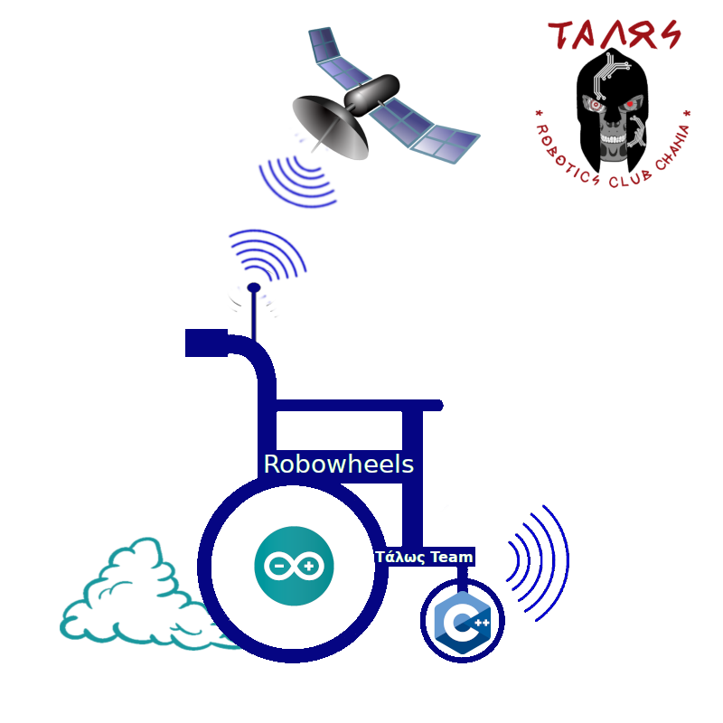
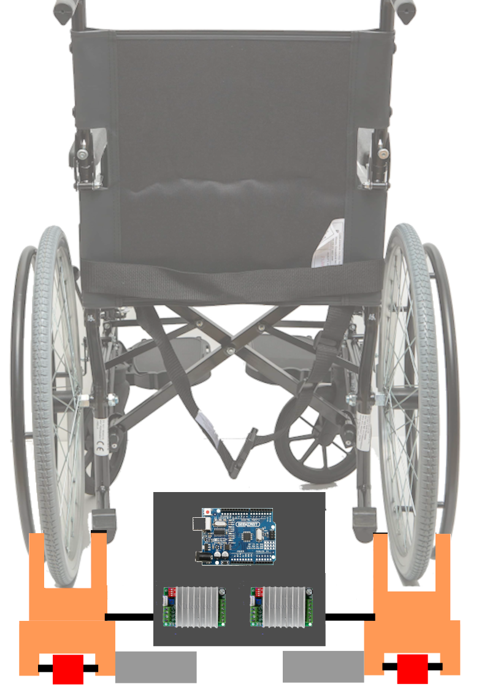
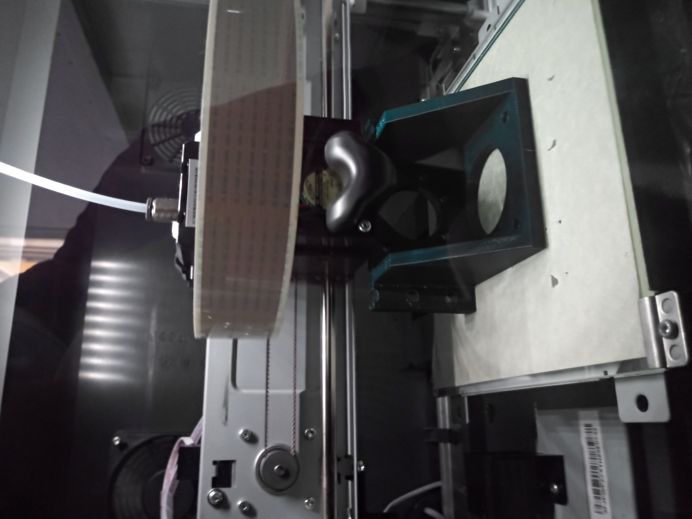

#   

# (The Robowheels project)

# Αυτοματοποιημένο αναπηρικό αμαξίδιο

# <u>Συμμετέχοντες</u>

### Υπεύθυνος εκπαιδευτικός

Μανούσακας Μανούσος - Εκπαιδευτικός Πληροφορικής ΠΕ86

### Μαθητές

*   Αναστασάκης Ιωάννης
*   Ρουσιάκης Πέτρος
*   Στραβοπόδη Κωνσταντίνα

# <u>Γενικά στοιχεία σεναρίου</u>

### <big>Σενάριο δραστηριότητας</big>

Αριθμός μαθητών: 5  
Αριθμός Ομάδων: 2  
Αριθμός ατόμων ανά ομάδα: 2-3  
Είδος δραστηριότητας: Ομαδοσυνεργατική  
Ρόλοι: Δεν υπάρχουν διακριτοί ρόλοι στην ομάδα.  
Ηλικιακή ομάδα: 12-15  

### <big>Φάση προετοιμασίας</big>

Οι μαθητές θα πρέπει να:  
• Διερευνήσουν στο διαδίκτυο και να ανακαλύψουν τις ανάγκες των ατόμων με κινητικά προβλήματα.  
• Συντάξουν ένα έντυπο όπου θα περιγράφουν τις προδιαγραφές του project.  
• Να αναζητήσουν στο διαδίκτυο πληροφορίες για τους αισθητήρες που θα χρησιμοποιήσουμε.  

### <big>Φάση σχεδιασμού</big>

Οι μαθητές θα πρέπει να:  
• Να αναζητήσουν στο διαδίκτυο πληροφορίες για τη συνδεσμολογία των αισθητήρων με το Arduino.  
• Να αναζητήσουν στο διαδίκτυο πληροφορίες για τις προδιαγραφές των αισθητήρων.  
• Να δημιουργήσουν στο Fritzing τις παραπάνω συνδεσμολογίες.  

### <big>Φάση υλοποίησης</big>

Οι μαθητές θα πρέπει να:  
• Δημιουργήσουν τις φυσικές συνδέσεις των υλικών τους με τους αισθητήρες.  
• Να προγραμματίσουν το Arduino χρησιμοποιώντας το περιβάλλον Arduino IDE έτσι ώστε να παίρνουν τιμές από τους αισθητήρες.  

### <big>Φάση Δοκιμών</big>

Οι μαθητές θα πρέπει να:  
• Δοκιμάσουν τον εξοπλισμό τους και να επιβεβαιώσουν τη σωστή λειτουργία του.  

### <big>Υλικά</big>

<table style="width: 100%;" border="1">

<tbody>

<tr>

<th>ΠΟΣΟΤΗΤΑ</th>

<th>ΕΙΔΟΣ</th>

<th>ΚΟΣΤΟΣ</th>

<th>Σχόλια</th>

</tr>

<tr>

<td>3</td>

<td>ARDUINO UNO</td>

<td>75</td>

<td>Ίσως δημιουργηθούν 3 διαφορετικά υποσυστήματα</td>

</tr>

<tr>

<td>2</td>

<td>GP2Y0A21YK0F Sharp IR Analog Distance Sensor</td>

<td>19,68</td>

<th>  
</th>

</tr>

<tr>

<td>1</td>

<td>Adafruit Επιταχυνσιόμετρο 3 Αξόνων ±2/4/8g @ 14-bit - MMA8451</td>

<td>9,80</td>

<th>  
</th>

</tr>

<tr>

<td>2</td>

<td>Βηματικός Κινητήρας 30kg.cm (200 steps/rev) 57BYGH115</td>

<td>84</td>

<th>  
</th>

</tr>

<tr>

<td>1</td>

<td>Οδηγός για Βηματικό Κινητήρα</td>

<td>?</td>

<th>  
</th>

</tr>

<tr>

<td>3</td>

<td>LM2596 Step Down Module DC 3V-40V to 5V 12V 3A Voltage Regulator</td>

<td>15</td>

<th>  
</th>

</tr>

<tr>

<td>1</td>

<td>Voice Recognition Module Rev3 Kit -Arduino Compatible</td>

<td>16</td>

<th>  
</th>

</tr>

<tr>

<td>1</td>

<td>SIM808 GPS GSM GPRS Bluetooth Module W/2.4G Antenna Replace SIM908 For Arduino</td>

<td>18</td>

<th>  
</th>

</tr>

<tr>

<td>2</td>

<td>Πυκνωτές >10μF</td>

<td></td>

<td></td>

</tr>

<tr>

<td>2</td>

<td>UPS BATTERY 12V 14AH MAX. 210A</td>

<td>20</td>

<td></td>

</tr>

<tr>

<td>  
</td>

<td>Σύνολο</td>

<td>153,7</td>

<th>  
</th>

</tr>

</tbody>

</table>

### <big>Χρήσιμα αρχεία</big>

<table style="width: 100%;" border="1">

<tbody>

<tr>

<th>ΠΕΡΙΓΡΑΦΗ</th>

<th>ΜΕΤΑΦΟΡΤΩΣΗ</th>

<th>ΣΧΟΛΙΑ</th>

</tr>

<tr>

<td>SharpIR Βιβλιοθήκη</td>

<td>[SharpIR Βιβλιοθήκη](https://github.com/guillaume-rico/SharpIR.git)</td>

<td></td>

</tr>

<tr>

<td>Adafruit MMA8451 Βιβλιοθήκη</td>

<td>[Adafruit MMA8451 Βιβλιοθήκη](https://github.com/adafruit/Adafruit_MMA8451_Library.git)</td>

<th>  
</th>

</tr>

<tr>

<td>Adafruit Sensor Βιβλιοθήκη</td>

<td>[Adafruit Sensor Βιβλιοθήκη](https://github.com/adafruit/Adafruit_Sensor.git)</td>

<td></td>

</tr>

<tr>

<td>Voice Recognition Module οδηγός χρήσης</td>

<td>[VR3_manual.pdf](images/VR3_manual.pdf)</td>

<td></td>

</tr>

<tr>

<td>Voice Recognition Module Βιβλιοθήκη</td>

<td>[VR3 library](https://www.google.com/url?q=https%3A%2F%2Fgithub.com%2Felechouse%2FVoiceRecognitionV3%2Farchive%2Fmaster.zip&sa=D&sntz=1&usg=AFQjCNE7a6-RkPLi9FMpjxIFqR-6OoMh5Q)</td>

<td></td>

</tr>

<tr>

<td></td>

<td></td>

<td></td>

</tr>

<tr>

<td></td>

<td></td>

<td></td>

</tr>

</tbody>

</table>

### <big>Υλικά για την κατασκευή</big>

<table style="width: 100%;" border="1">

<tbody>

<tr>

<th>ΠΟΣΟΤΗΤΑ</th>

<th>ΕΙΔΟΣ</th>

<th>ΚΟΣΤΟΣ</th>

<th>Σχόλια</th>

</tr>

<tr>

<td></td>

<td></td>

<td></td>

<td></td>

</tr>

<tr>

<td></td>

<td></td>

<td></td>

<th>  
</th>

</tr>

<tr>

<td></td>

<td></td>

<td></td>

<th>  
</th>

</tr>

<tr>

<td></td>

<td></td>

<td></td>

<th>  
</th>

</tr>

</tbody>

</table>

### Προοπτική κατασκευής

### <big>Αναλυτική περιγραφή</big>

<pre>Οι μαθητές αφού βρουν στοιχεία για την τετραπληγία και την παραπληγία 
θα μελετήσουν τις ανάγκες και τις λειτουργικές ικανότητες των ατόμων αυτών. 
Σκοπός είναι η δημιουργία ενός αυτοματοποιημένου οχήματος μετακίνησης που θα
προσαρμόζεται ανάλογα το μέλος του σώματος που θα είναι ικανός να θέσει σε
κίνηση ο χρήστης του. Θα παρέχει βασικές δικλείδες ασφαλείας για την ακινητοποίησή του. 
Ανάλογα την οικονομική και χρονική δυνατότητα που θα έχουμε, θα μπορούσε να προστεθεί 
και σύστημα εντοπισμού θέσης και επικοινωνίας που θα μπορεί να θέσει 
ο χρήστης σε λειτουργία σε περίπτωση κινδύνου.

Σκοπός και οφέλη

    • Ευαισθητοποίηση των μαθητών στο κοινωνικό θέμα της αναπηρίας.
    • Αναζήτηση λύσεων μετά από μελέτη προδιαγραφών και απαιτήσεων.
    • Εισαγωγή στην κατασκευή και λειτουργία βασικών ηλεκτρονικών κυκλωμάτων.
    • Εισαγωγή σε προγραμματιστικά περιβάλλοντα.
    • Εισαγωγή σε θέματα μηχανικής και κατασκευών.
    • Ομαδική δουλειά και συνεργασία.</pre>

# <u>Πλατφόρμες που χρησιμοποιήθηκαν</u>

Όλα τα διαδικτυακά εργαλεία που χρησιμοποιήσαμε ανήκουν στο Πανελλήνιο σχολικό δίκτυο.  

<small><small><small><small>**Πλατφόρμες εργασίας**</small></small></small></small>

<dl>

<dt><small><small><small><small>**Ηλεκτρονική τάξη:** https://eclass.sch.gr</small></small></small></small></dt>

<dt><small><small><small><small>**Πλατφόρμα τηλεδιασκέψεων:** cisco webex</small></small></small></small></dt>

<dt><small><small><small><small>**Ομαδοσυνεργατικά έγγραφα:** https://grafis.sch.gr</small></small></small></small></dt>

<dt><small><small><small><small>**Ηλεκτρονικό ταχυδρομείο:** https://webmail.sch.gr</small></small></small></small></dt>

<dt><small><small><small><small>**Υπηρεσία Επικοινωνίας:**</small></small><small> <small></small> </small><small><small>https://www.uc.sch.gr</small></small></small></small></dt>

</dl>

# <u>Εργαλεία ΕΛΛΑΚ που χρησιμοποιήθηκαν</u>

*   Libreoffice
*   Linux - Elementary OS
*   Arduino IDE
*   Fritzing

# <u>Πληροφορίες για το υλικό</u>

### Αισθητήρας GP2Y0A21 IRDA

  

<pre>Οι αισθητήρες απόστασης Sharp είναι μια δημοφιλής επιλογή για πολλά έργα που απαιτούν ακριβείς μετρήσεις απόστασης. 

Αυτός ο αισθητήρας υπερύθρων είναι απο τους πιο οικονομικούς, ωστόσο παρέχει πολύ καλύτερη απόδοση από άλλες εναλλακτικές λύσεις IR.
Η διασύνδεση με τους περισσότερους μικροελεγκτές είναι απλή.
Το εύρος ανίχνευσης αυτής της έκδοσης είναι περίπου 10 cm έως 80 cm (4 ″ έως 32).

Το GP2Y0A21 χρησιμοποιεί υποδοχή 3 ακίδων.Αυτά τα καλώδια έχουν συνδετήρες JST 3 ακίδων στο ένα άκρο και διατίθενται με προ-πτυχωμένες αρσενικές ακίδες,
στο άλλο άκρο. 
Είναι επίσης δυνατή η συγκόλληση τριών καλωδίων στον αισθητήρα όπου είναι τοποθετημένες οι ακίδες σύνδεσης 

Κόκκινο --> 5V
Μαύρο --> GND
Κίτρινο --> DATA (Αναλογικό)
</pre>

### Αισθητήρας Adafruit Επιταχυνσιόμετρο 3 Αξόνων ±2/4/8g @ 14-bit - MMA8451

  

<pre>Το MMA8451 είναι ένα μικροσκοπικό επιταχυνσιόμετρο από την Freescale, η οποία είναι (πλέον) αυθεντία στο παιχνίδι του σχεδιασμού επιταχυνσιόμετρων.
Έχει σχεδιαστεί για χρήση σε τηλέφωνα, tablet, έξυπνα ρολόγια και άλλα, αλλά λειτουργεί εξίσου καλά και στο έργο σας Arduino.
Από την οικογένεια MMA8451/MMA8452/MMA8453, ο MMA8451 είναι ο πιο ακριβής με ενσωματωμένο ADC 14-bit.
Το επιταχυνσιόμετρο διαθέτει επίσης ενσωματωμένη ανίχνευση κλίσης/προσανατολισμού, ώστε να μπορεί να σας πει αν το έργο σας βρίσκεται σε οριζόντια ή κατακόρυφη θέση
και αν έχει κλίση προς τα εμπρός ή προς τα πίσω.

Τυπική Τάση Εισόδου:
    3VDC
    5VDC
Ρεύμα Λειτουργίας: 165uA
Διασύνδεση:Ψηφιακή 
Πρωτόκολλο Eπικοινωνίας:I2C

 **Αρχή λειτουργίας επιταχυνσιόμετρου.**

<iframe width="560" height="315" src="https://www.youtube.com/embed/To7JagpPDwY" title="YouTube video player" frameborder="0" allow="accelerometer; autoplay; clipboard-write; encrypted-media; gyroscope; picture-in-picture" allowfullscreen=""></iframe>
</pre>

### Βηματικός Κινητήρας 30kg.cm (200 steps/rev) 57BYGH115

  

<pre>Οι βηματικοί κινητήρες (stepper motor) είναι κινητήρες DC που κινούνται σε διακριτά βήματα.
Έχουν πολλά πηνία που οργανώνονται σε ομάδες και ονομάζονται "φάσεις".
Με την ενεργοποίηση κάθε φάσης σε σειρά, ο κινητήρας θα περιστραφεί, ένα βήμα κάθε φορά.
Ελεγχόμενο από έναν υπολογιστή μπορείτε να επιτύχετε ακριβή ρύθμιση θέσης και ταχύτητας.
Για το λόγο αυτό, οι βηματικοί κινητήρες είναι κινητήρες για πολλές εφαρμογές ελέγχου ακριβείας.
Οι βηματικοί κινητήρες έρχονται σε πολλά διαφορετικά μεγέθη, στυλ και ηλεκτρικά χαρακτηριστικά.

**Σε τι είναι καλοί οι βηματικοί κινητήρες:**

*   Θέση (Positioning) - Δεδομένου ότι κινούνται σε ακριβή επαναλαμβανόμενα βήματα, υπερέχουν σε εφαρμογές που απαιτούν ακριβή κίνηση,	όπως 3D εκτυπωτές, CNC, πλατφόρμες κάμερας και X, Y Plotters.

*   Έλεγχος ταχύτητας (Speed Control) - Τα ακριβή βήματα της κίνησης επιτρέπουν επίσης εξαιρετικό έλεγχο της ταχύτητας περιστροφής για την αυτοματοποίηση της διαδικασίας και τη ρομποτική.

*   Ροπή χαμηλής ταχύτητας (Low Speed Torque) - Οι κανονικοί κινητήρες DC δεν έχουν μεγάλη ροπή σε χαμηλές ταχύτητες. Ένας βηματικός κινητήρας έχει μέγιστη ροπή σε χαμηλές ταχύτητες, έτσι είναι μια καλή επιλογή για εφαρμογές που απαιτούν χαμηλή ταχύτητα με μεγάλη ακρίβεια.

**Ποιοι είναι οι περιορισμοί τους:**

*   Χαμηλή απόδοση (Low Efficiency) - Σε αντίθεση με τους κινητήρες DC, η κατανάλωση ρεύματος του βηματικού κινητήρα είναι ανεξάρτητη από το φορτίο.

*   Τραβάνε ρεύμα ακόμα και όταν δεν δουλεύουν καθόλου. Εξαιτίας αυτού, έχουν την τάση να ζεσταίνονται.

*   Περιορισμένη ροπή υψηλής ταχύτητας (Limited High Speed Torque) - Σε γενικές γραμμές, οι βηματικοί κινητήρες έχουν μικρότερη ροπή σε υψηλές ταχύτητες σε σχέση με τις χαμηλές ταχύτητες.

*   Ορισμένοι βηματικοί κινητήρες είναι βελτιστοποιημένοι για καλύτερη απόδοση υψηλής ταχύτητας,αλλά πρέπει να συνδυαστούν με έναν κατάλληλο οδηγό (driver) για την επίτευξη αυτής της απόδοσης.

*   Χωρίς ανάδραση (No Feedback) - Σε αντίθεση με τα servo, τα περισσότερα βηματικά μοτέρ δεν έχουν ολοκληρωμένη ανατροφοδότηση για τη θέση.

*   Αν και μεγάλη ακρίβεια μπορεί να επιτευχθεί με λειτουργία «ανοικτού βρόχου».

*   Οι περιοριστικοί διακόπτες (limit switches) ή οι «home detectors» τυπικά απαιτούνται για την ασφάλεια και/ή για τη δημιουργία μιας θέσης αναφοράς.

**Όπως διαπιστώνουμε απο τα παραπάνω, ένας κινητήρας DC και όχι βηματικός θα έκανε πολύ καλύτερα το έργο για το οποίο προορίζεται.
Η επιλογή του βηματικού κινητήρα έγινε με γνώμονα τη χρήση του και σε επιμέρους project.**
	</pre>

### Stepper Motor Driver TB6600

  

<pre>TB6600 stepper motor Driver Controller 4.5A 8-50V TTL 16 Micro-Step CNC Single-Axis βασισμένο στο τσιπ TB6600HG.
Αυτός ο ελεγκτής είναι κατάλληλος για την κατασκευή όχι μόνο ερασιτεχνικών συστημάτων CNC αλλά και επαγγελματικών που βασίζονται σε κινητήρες υψηλής ισχύος.
Σε σύγκριση με την προηγούμενη γενιά του TB6560AHG, η ισχύς του TB6600HG αυξήθηκε στα 200W, η τάση λειτουργίας αυξάνεται από 35V (TB6560AHG) σε 50V, το ρεύμα λειτουργίας αυξάνεται σε 4,5Α (μέγιστη τιμή 5Α).
Η μέγιστη συχνότητα λειτουργίας έχει αυξηθεί.

ΧΑΡΑΚΤΗΡΙΣΤΙΚΑ
Max. Current per Channel: 4.5A
Τύπος Οδηγού:

    Stepper

ΕΠΙΠΛΕΟΝ ΧΑΡΑΚΤΗΡΙΣΤΙΚΑ

    Power Supply:  8V - 50V DC (36V recommended).
    Output current: 0.3A - 4.5A (peak value of 5A).
    Micro Step: 1 .. 2 .. 8 .. 16.
    Maximum PWM frequency: 200kHz.
    Adjustments for the maximum current of the LED: 1A .. 2.2A .. 3.3A .. 4.5A.
    Hold Current Adjustment: 50% or 100%.
    Operating temperature: -10 to + 45 ° С.

    Το ρεύμα εξόδου είναι ρυθμιζόμενο ώστε να ικανοποιεί τις διάφορες απαιτήσεις.
    Αυτόματη λειτουργία μισού ρεύματος. Και ημιαυτόματο διακόπτη ροής, εύκολο στη χρήση.
    Η χρήση οπτικής σύζευξης υψηλής ταχύτητας 6N137 εξασφαλίζει υψηλή ταχύτητα χωρίς να χάσετε βήμα.
    Προστασία βραχυκυκλώματος εξόδου.
</pre>

### Μετατροπέας DC-DC Step-Down 1.3-35V 3A

  

<pre>Πρόκειται για ένα DC Adjustable Step Down Module που μπορεί να χρησιμοποιηθεί 
για την επίτευξη εύρους ρυθμιζόμενης τάσης εξόδου 1.3V-35V με βάση το LM2596S.
Περιλαμβάνει LC Ripple Filtering για ομαλότερη τάση εξόδου.

ΧΑΡΑΚΤΗΡΙΣΤΙΚΑ
Τάση Εισόδου: 3.2-40Volt
Τάση Εξόδου: 1.3-35Volt
Ένταση Εξόδου: 3Amp
ΕΠΙΠΛΕΟΝ ΧΑΡΑΚΤΗΡΙΣΤΙΚΑ

    Input voltage 3.2V - 40V
    Output voltage 1.3V - 35V
    Output current 3A (max)
    Conversion efficiency of 92% (maximum)
    Output ripple <30mV
    Switching frequency 65KHz
    Operating temperature -45 ℃ ~ +85 ℃
</pre>

### Αισθητήρας Αναγνώρισης Φωνής

  

<pre>
Το Voice Recognition Module είναι μια εύχρηστη μονάδα αναγνώρισης ομιλίας που μπορεί εύκολα να διασυνδεθεί με το Arduino.
Υποστηρίζει συνολικά έως και 80 φωνητικές εντολές.
Μέγιστες 7 φωνητικές εντολές θα μπορούσαν να λειτουργήσουν ταυτόχρονα. Κάθε ήχος θα μπορούσε να εκπαιδευτεί ως εντολή.
Οι χρήστες πρέπει πρώτα να εκπαιδεύσουν τη μονάδα πριν την αφήσουν να αναγνωρίσει οποιαδήποτε φωνητική εντολή.

ΧΑΡΑΚΤΗΡΙΣΤΙΚΑ
Τύπος Αισθητήρα:

    Ήχου

Τυπική Τάση Εισόδου:

    5VDC
    5.5VDC

Ρεύμα Λειτουργίας: 40mA
Διασύνδεση:

    Ψηφιακή 

Πρωτόκολλο Eπικοινωνίας:

    UART

ΕΠΙΠΛΕΟΝ ΧΑΡΑΚΤΗΡΙΣΤΙΚΑ

    Voltage: 4.5-5.5V
    Current: <40mA
    Digital Interface: 5V TTL level for UART interface and GPIO
    Analog Interface: 3.5mm mono-channel microphone connector + microphone pin interface
    Recognition accuracy: 99% (under ideal environment)
</pre>

### Waveshare GSM/GPRS/GPS Shield SIM808

  

<pre>ΠΕΡΙΓΡΑΦΗ

Το GSM/GPRS/GPS Shield (B) είναι μια ασπίδα Arduino που βασίζεται στη μονάδα τεσσάρων ζωνών GSM/GPRS/GPS SIM808.

ΧΑΡΑΚΤΗΡΙΣΤΙΚΑ
Τυπος Shield:

    GPRS/GSM
    GPS

ΕΠΙΠΛΕΟΝ ΧΑΡΑΚΤΗΡΙΣΤΙΚΑ

    Arduino connectivity, compatible with UNO, Leonardo, NUCLEO, XNUCLEO
    Onboard USB TO UART converter CP2102 for UART debugging
    5 x LEDs for indicating the module working status
    Onboard voltage level converter, supports both 3.3V and 5V systems
    SIM card slot for 1.8V/3V SIM card
    Baudrate auto detection (1200bps ~115200bps)
    Bluetooth 3.0， supports data transferring through Bluetooth
    RTC with power supply interface
    Firmware upgradable via USB
    Control via AT commands (3GPP TS 27.007,27.005, and SIMCOM enhanced AT Commands)
    Supports SIM application toolkit: GSM 11.14 Release 99
    Operating voltage: 6 ~ 12V
    Operation temperature: -40 °C ~ +85 °C
    Storage temperature: -45 °C ~ +90 °C

ΔΥΝΑΤΟΤΗΤΕΣ

GSM/GPRS

    Band
        GSM 850/EGSM 900/DCS 1800/PCS 1900 MHz
        Quad-band auto search
        Compliant to GSM phase 2/2+
    Emitting power
        Class 4 (2W @ GSM 850/EGSM 900 MHz)
        Class 1 (1W @ DCS 1800/PCS 1900 MHz)
    GPRS connectivity
        GPRS multi-slot class 12 (default)
        GPRS multi-slot class 1~12 (configurable)
    GPRS data feature
        Downlink speed: max 85.6kbps
        Uplink speed: max 85.6kbps
        Coding schemes: CS-1\CS-2\CS-3\CS-4
        Supports PAP (Password Authentication Protocol) for PPP connection
        Embedded TCP/IP protocol
        Supports PBCCH
        Supports CSD transmission speed: 2.4/4.8/9.6/14.4 kbps
        Supports USSD
    SMS
        Supports: MT/MO/CB/Text/PDU mode
        SMS storage: SIM card
    Audio
        Voice encode/decode mode: Half Rate\Full Rate\Enhanced Full Rate\Adaptive muti rate
        Supports echo cancellation
        Supports noise reduction

GPS

    Receiver type
        22 tracking channels
        66 acquisition channels
        GPS L1 C/A code
    Sensitivity
        Tracking: -165 dBm
        Cold starts : -148 dBm
    Time-To-First-Fix
        Cold starts : 30s (typ.)
        Hot starts : < 1s
        Warm starts: 28s
    Accuracy
        Horizontal position : <2.5m CEP
</pre>

# Συνδεσμολογία Υλικού

### Περίπτωση 1 - Με τη χρήση ΜΜΑ8451

<pre>**<u>ΠΕΡΙΓΡΑΦΗ ΛΕΙΤΟΥΡΓΙΑΣ</u>**

</pre>

  

#### Δείτε τον κώδικα

<xmp>#include <SharpIR.h> #include <Wire.h> #include <Adafruit_MMA8451.h> #include <Adafruit_Sensor.h> // ΜΕΤΑΒΛΗΤΕΣ ΓΙΑ ΤΟ ΑΡΙΣΤΕΡΟ ΜΟΤΕΡ byte directionPin = 4; byte stepPin = 3; byte enablePin = 2; int numberOfSteps = 400; int millisbetweenSteps = 1; //ΜΕΤΑΒΛΗΤΕΣ ΓΙΑ ΤΟ ΔΕΞΙ ΜΟΤΕΡ byte directionPin_R = 7; byte stepPin_R = 6; byte enablePin_R = 5; int numberOfSteps_R = 400; int distance1; int distance2; SharpIR sensor1 ( SharpIR:: GP2Y0A21YK0F, A0); SharpIR sensor2 ( SharpIR:: GP2Y0A21YK0F, A1); Adafruit_MMA8451 mma = Adafruit_MMA8451(); void setup() { Serial.begin(9600); //ΑΡΧΙΚΟΠΙΟΙΣΗ ΚΑΙ ΕΝΕΡΓΟΠΙΟΙΣΗ PINS ΑΡΙΣΤΕΡΟΥ ΜΟΤΕΡ pinMode(directionPin, OUTPUT); pinMode(stepPin, OUTPUT); pinMode(enablePin, OUTPUT); digitalWrite(enablePin, HIGH); digitalWrite(directionPin, HIGH); //ΑΡΧΙΚΟΠΙΟΙΣΗ ΚΑΙ ΕΝΕΡΓΟΠΙΟΙΣΗ PINS ΔΕΞΙΟΥ ΜΟΤΕΡ pinMode(directionPin_R, OUTPUT); pinMode(stepPin_R, OUTPUT); pinMode(enablePin_R, OUTPUT); digitalWrite(enablePin_R, HIGH); digitalWrite(directionPin_R, HIGH); delay(100); Serial.println("Adafruit MMA8451 test!"); if (! mma.begin()) { Serial.println("Couldnt start"); while (1); } Serial.println("MMA8451 found!"); } void loop() { // Διαβαζουμε τις τιμες του αισθητηρα mma8451 mma.read(); Serial.print("X:\t"); Serial.print(mma.x); Serial.print("\tY:\t"); Serial.print(mma.y); Serial.println(); distance1 = sensor1.getDistance(); distance2 = sensor2.getDistance(); Serial.print(distance1); Serial.print(" , "); Serial.println(distance2); // ελεγχουμε τις συνθηκες για να παει το μοτερ μπροστα if (distance1 >= 40 and distance2 <= 15 && mma.y >= 1800) { Serial.print("ΜΟΤΕΡ 1 ON"); for(int n = 0; n <numberOfSteps; n++) { Serial.print("ΜΟΤΕΡ 1 ON"); digitalWrite(stepPin, HIGH); digitalWrite(stepPin, LOW); digitalWrite(stepPin_R, HIGH); digitalWrite(stepPin_R, LOW); delay(millisbetweenSteps); } delay(1); } // ελεγχουμε τις συνθηκες για να παει το μοτερ πισω if (distance1 >= 40 and distance2 <= 15 && mma.y <= -1800) { Serial.print(numberOfSteps); for(int n = numberOfSteps; n > 0; n--) { Serial.print("ΜΟΤΕΡ 1 ON ΠΙΣΩ"); digitalWrite(stepPin, HIGH); digitalWrite(stepPin, LOW); digitalWrite(stepPin_R, HIGH); digitalWrite(stepPin_R, LOW); delay(millisbetweenSteps); } delay(1); } //ελεγχουμε τις συνθηκες για να στριξει το μοτερ δεξια if (distance1 >= 40 and distance2 <= 15 && mma.x >= 1400) { Serial.print(numberOfSteps); for(int n = 0; n < 400; n++) { Serial.print("ΜΟΤΕΡ 1 ΔΕΞΙΑ"); digitalWrite(stepPin, HIGH); digitalWrite(stepPin, LOW); for(int n = 1; n >0 ; n--) { digitalWrite(stepPin_R, HIGH); digitalWrite(stepPin_R, LOW); } delay(millisbetweenSteps); } delay(100); } // ελεγχουμε τις συνθηκες για να παει το μοτερ αριστερα if (distance1 >= 40 and distance2 <= 15 && mma.x <= -1400) { Serial.print(numberOfSteps); for(int n = 400; n > 0; n--) { Serial.print("ΜΟΤΕΡ 1 ON ΑΡΙΣΤΕΡΑ"); digitalWrite(stepPin, HIGH); digitalWrite(stepPin, LOW); delay(millisbetweenSteps); } delay(100); } delay(1000); }</xmp>

### Περίπτωση 2 - Με τη χρήση Αναγνώρισης φωνής

<pre>**<u>ΠΕΡΙΓΡΑΦΗ ΛΕΙΤΟΥΡΓΙΑΣ</u>**

</pre>

#### Συνδεσμολογία

  

#### Εκπαιδεύστε το module σας

<iframe width="560" height="315" src="https://www.youtube.com/embed/bTrv1nv3oSA" title="YouTube video player" frameborder="0" allow="accelerometer; autoplay; clipboard-write; encrypted-media; gyroscope; picture-in-picture" allowfullscreen=""></iframe>

#### Δείτε τον κώδικα

<xmp>#include <SoftwareSerial.h> #include "VoiceRecognitionV3.h" #include <SharpIR.h> #include <Wire.h> // ΜΕΤΑΒΛΗΤΕΣ ΓΙΑ ΤΟ ΑΡΙΣΤΕΡΟ ΜΟΤΕΡ byte directionPin = 10; byte stepPin = 9; byte enablePin = 8; int numberOfSteps = 20; int millisbetweenSteps = 0; //ΜΕΤΑΒΛΗΤΕΣ ΓΙΑ ΤΟ ΔΕΞΙ ΜΟΤΕΡ byte directionPin_R = 4; byte stepPin_R = 6; byte enablePin_R = 5; int numberOfSteps_R = 20; int distance1; int distance2; SharpIR sensor1 ( SharpIR:: GP2Y0A21YK0F, A0); SharpIR sensor2 ( SharpIR:: GP2Y0A21YK0F, A1); /** Connection Arduino VoiceRecognitionModule 2 -------> TX 3 -------> RX */ VR myVR(2,3); // 2:RX 3:TX, you can choose your favourite pins. uint8_t records[7]; // save record uint8_t buf[64]; int ret2; #define mp (0) #define pi (1) #define de (2) #define ar (3) #define st (4) /** @brief Print signature, if the character is invisible, print hexible value instead. @param buf --> command length len --> number of parameters */ void printSignature(uint8_t *buf, int len) { int i; for(i=0; i<len; i++){ if(buf[i]>0x19 && buf[i]<0x7F){ Serial.write(buf[i]); } else{ Serial.print("["); Serial.print(buf[i], HEX); Serial.print("]"); } } } void setup() { /** initialize */ myVR.begin(9600); Serial.begin(115200); //ΑΡΧΙΚΟΠΙΟΙΣΗ ΚΑΙ ΕΝΕΡΓΟΠΙΟΙΣΗ PINS ΑΡΙΣΤΕΡΟΥ ΜΟΤΕΡ pinMode(directionPin, OUTPUT); pinMode(stepPin, OUTPUT); pinMode(enablePin, OUTPUT); digitalWrite(enablePin, HIGH); digitalWrite(directionPin, HIGH); //ΑΡΧΙΚΟΠΙΟΙΣΗ ΚΑΙ ΕΝΕΡΓΟΠΙΟΙΣΗ PINS ΔΕΞΙΟΥ ΜΟΤΕΡ pinMode(directionPin_R, OUTPUT); pinMode(stepPin_R, OUTPUT); pinMode(enablePin_R, OUTPUT); digitalWrite(enablePin_R, HIGH); digitalWrite(directionPin_R, HIGH); delay(100); Serial.println("Elechouse Voice Recognition V3 Module\r\nControl LED sample"); if(myVR.clear() == 0){ Serial.println("Recognizer cleared."); }else{ Serial.println("Not find VoiceRecognitionModule."); Serial.println("Please check connection and restart Arduino."); while(1); } if(myVR.load((uint8_t)mp) >= 0){ Serial.println("mprosta"); } if(myVR.load((uint8_t)pi) >= 0){ Serial.println("opisthen"); } if(myVR.load((uint8_t)de) >= 0){ Serial.println("ena"); } if(myVR.load((uint8_t)ar) >= 0){ Serial.println("dio"); } if(myVR.load((uint8_t)st) >= 0){ Serial.println("stop"); } } void loop() { distance1 = sensor1.getDistance(); distance2 = sensor2.getDistance(); if (distance1 >= 40 and distance2 <= 20) { } int ret; ret = myVR.recognize(buf, 50); if(ret>0){ switch(buf[1]){ case mp:{ Serial.println("pao mprosta "); Serial.println(String(buf[1])); Serial.println(myVR.recognize(buf, 50)); Serial.print(distance1); Serial.print(" , "); Serial.print(distance2); Serial.print(" *** "); if (distance1 >= 40 and distance2 <= 20) { Serial.println("ΜΟΤΕΡ 1 ON"); digitalWrite(directionPin_R, LOW); digitalWrite(directionPin, HIGH); ret2 =0; int flag = 0; while(distance1 >= 40 and distance2 <= 20 and flag == 0) { Serial.println("ΜΟΤΕΡ 1 ON ΜΠΡΟΣΤΑ" + String(flag)); digitalWrite(stepPin, HIGH); digitalWrite(stepPin, LOW); digitalWrite(stepPin_R, HIGH); digitalWrite(stepPin_R, LOW); ret2 = myVR.recognize(buf, 50); Serial.println("ret2=" + String(ret2)); if (ret2>0 and buf[1]>3){ flag=1; Serial.println("****************************************************"); } distance1 = sensor1.getDistance(); distance2 = sensor2.getDistance(); } } break; } case pi:{ Serial.println("pao piso"); Serial.println(buf[1]); Serial.println(myVR.recognize(buf, 50)); digitalWrite(directionPin_R, HIGH); digitalWrite(directionPin, LOW); ret2 =0; int flag = 0; while(flag == 0) { Serial.println("ΜΟΤΕΡ 1 ON πισω" + String(flag)); digitalWrite(stepPin, HIGH); digitalWrite(stepPin, LOW); digitalWrite(stepPin_R, HIGH); digitalWrite(stepPin_R, LOW); ret2 = myVR.recognize(buf, 50); Serial.println("ret2=" + String(ret2)); if (ret2>0 and buf[1]>3){ flag=1; Serial.println("****************************************************"); } distance1 = sensor1.getDistance(); distance2 = sensor2.getDistance(); } break; } case de:{ Serial.println("pao deksia"); Serial.println(buf[1]); Serial.println(myVR.recognize(buf, 50)); digitalWrite(directionPin_R, HIGH); digitalWrite(directionPin, HIGH); ret2 =0; int flag = 0; while(flag == 0) { Serial.println("ΜΟΤΕΡ 1 ON δεξια" + String(flag)); digitalWrite(stepPin, HIGH); digitalWrite(stepPin, LOW); digitalWrite(stepPin_R, HIGH); digitalWrite(stepPin_R, LOW); ret2 = myVR.recognize(buf, 50); Serial.println("ret2=" + String(ret2)); if (ret2>0 and buf[1]>3){ flag=1; Serial.println("****************************************************"); } distance1 = sensor1.getDistance(); distance2 = sensor2.getDistance(); } break; } case ar:{ Serial.println("pao aristera"); Serial.println(buf[1]); Serial.println(myVR.recognize(buf, 50)); digitalWrite(directionPin_R, LOW); digitalWrite(directionPin, LOW); ret2 =0; int flag = 0; while(flag == 0) { Serial.println("ΜΟΤΕΡ 1 ON αριστερα" + String(flag)); digitalWrite(stepPin, HIGH); digitalWrite(stepPin, LOW); digitalWrite(stepPin_R, HIGH); digitalWrite(stepPin_R, LOW); ret2 = myVR.recognize(buf, 50); Serial.println("ret2=" + String(ret2)); if (ret2>0 and buf[1]>3){ flag=1; Serial.println("****************************************************"); } distance1 = sensor1.getDistance(); distance2 = sensor2.getDistance(); } break; } case st: Serial.println("stamatao"); Serial.println(ret); Serial.println(buf[1]); Serial.println(myVR.recognize(buf, 50)); break; default: Serial.println("Record function undefined"); break; } } }</xmp>

# <u>

Στάδια εξέληξης

</u>

<table style="width: 100%;" border="1">

<tbody>

<tr align="center">

<td></td>

<td></td>

<td></td>

<td></td>

</tr>

<tr align="center">

<td></td>

<td></td>

<td></td>

<td></td>

</tr>

<tr align="center">

<td></td>

<td></td>

<td></td>

<td></td>

</tr>

<tr align="center">

<td></td>

<td></td>

<td></td>

<td></td>

</tr>

<tr align="center">

<td></td>

<td></td>

<td></td>

<td></td>

</tr>

<tr align="center">

<td></td>

<td></td>

<td></td>

<td></td>

</tr>

<tr align="center">

<td><video controls=""><source src="images/v1.mp4" type="video/mp4"> Your browser does not support HTML video.</video> </td>

<td></td>

<td></td>

<th>  
</th>

</tr>

<tr align="center">

<td></td>

<td></td>

<td></td>

<th>  
</th>

</tr>

<tr align="center">

<td></td>

<td></td>

<td></td>

<th>  
</th>

</tr>

<tr align="center">

<td>  
</td>

<td></td>

<td></td>

<th>  
</th>

</tr>

</tbody>

</table>

# <u>

Τελικά συμπερασματα

</u>

### Γενικά

### Αδυναμίες και βελτιώσεις

